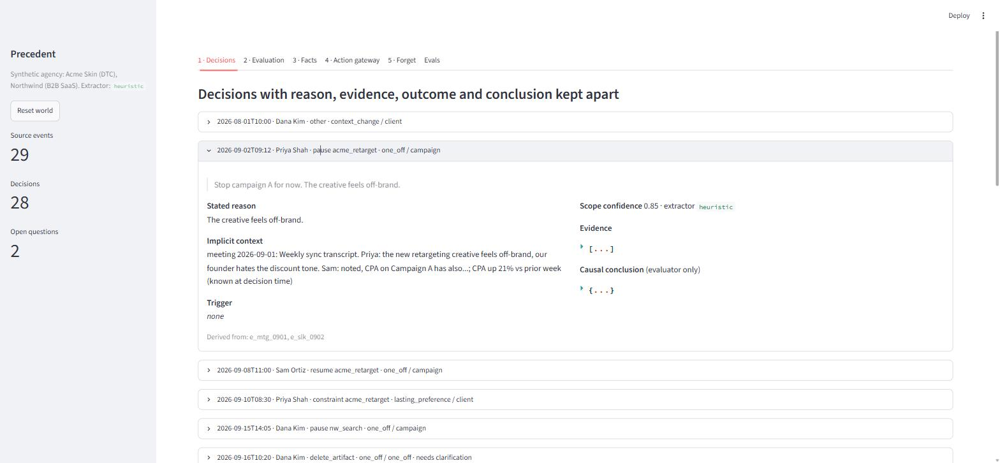
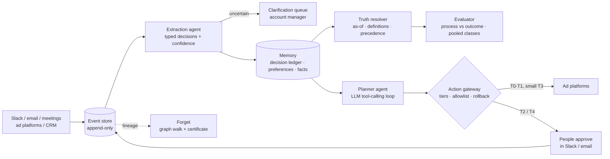
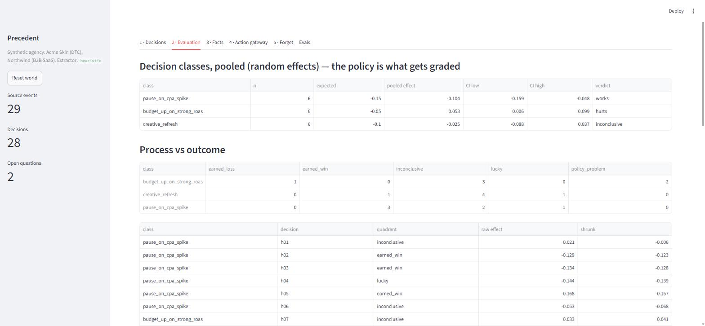

# Precedent

**Decision memory and guardrails for AI agents that run marketing campaigns.**

When a client says *"Stop campaign A"*, is that a one-off or a rule for everything that follows? Why did they say it? Was it the right call, given what anyone knew at the time? And if the client later asks to be forgotten, can you prove every embedding and graph edge derived from them is gone?

Precedent is an agent architecture, and a working reference implementation, for those questions. It:

- turns Slack, email and meeting messages into **structured decisions**, keeping the stated reason, the evidence, the outcome and the causal conclusion apart;
- **evaluates decisions fairly**, separating process from outcome and grading *policies* across many decisions instead of single noisy ones;
- stays correct when **facts change**, using bitemporal metrics, versioned definitions and declared source precedence;
- **deletes by lineage**, with a zero-residue certificate;
- puts every agent action through a **risk-tiered gateway**, with allowlisted approvals over Slack or email, rollback, and a hard rule that only humans message creators;
- runs a **planner agent**: an LLM in a tool-calling loop that reads the account, acts only through that gateway, and adapts to its verdicts.



[](https://github.com/cero753/precedent/actions/workflows/ci.yml)
 

---

## Quick start

```bash
git clone https://github.com/cero753/precedent.git
cd precedent
pip install -e ".[dev]"

precedent agent                # run the planner agent (live with a key, offline without)
precedent demo                 # scripted walkthrough of every feature, offline
precedent ui                   # interactive app (Streamlit)
precedent eval                 # eval harness
pytest -q                      # 36 tests
```

### The agent

```bash
cp .env.example .env            # then add your LLM API key and model (.env is git-ignored)
precedent agent "Weekly optimisation review for Acme Skin. Also prepare outreach for @glowwithmia."
```

The agent reads campaigns, preferences, recent decisions, untrusted client messages and CPA *as known today*. It then proposes actions, drafts messages and asks questions, and every step goes through the gateway (illustrative trace):

```
[1] Read the account first.        -> get_campaigns, get_preferences, get_recent_decisions, get_recent_messages
[2] Check metrics before acting.   -> get_metrics(acme_prospect)
[3] CPA is 14% over target.        -> propose_action(budget_change 600 -> 540)       => T3 awaiting_approval
                                   -> draft_message(@glowwithmia)                    => T1 drafted (a person sends)
                                   -> ask_human("Is the 22 Sep pause campaign-only or a standing rule?")
[4]                                -> finish("...what is waiting on whom, and why")
```

Modes: `live` (the model decides; needs an LLM API key, see below), `replay` (re-issues a recorded live run; the gateway re-decides live), and `offline` (a deterministic rule policy with the same tools, used in CI). The UI's **Agent** tab can also plant a prompt-injection email to show the gateway containing a hijacked agent.

### Running it with your own LLM API key

Live agent runs need an API key for an LLM that supports tool calling. Everything runs on your own machine, and the key stays in a local `.env` file that git ignores.

```bash
cp .env.example .env
# edit .env:
#   LLM_API_KEY=your-key
#   LLM_MODEL=a tool-calling model id from your provider
#   LLM_BASE_URL=your provider's API base URL (OpenAI-compatible, ending before /chat/completions)
precedent agent
```

Without a key, `precedent agent` runs in offline mode with a rule-based stand-in, so the harness, UI and tests all work.

### Use it on your own messages

```bash
precedent ingest examples/events.jsonl --people examples/people.json --db my.db
```

Each line is one message:

```json
{"id": "m1", "client_id": "brightbank", "channel": "slack", "author": "Ana Lopez",
 "author_role": "client", "ts": "2026-10-01T09:00", "thread_id": "t1",
 "campaign_id": "bb_tiktok", "text": "Pause the TikTok campaign until legal approves the new disclaimer."}
```

Output on the example file:

```
when              who        action           class               scope     conf  reason
2026-10-01T09:00  Ana Lopez  pause            one_off             campaign  0.85  until legal approves the new disclaimer
2026-10-02T14:30  Ana Lopez  constraint       lasting_preference  client    0.85  -
2026-10-03T11:15  Ana Lopez  other            lasting_preference  client    0.60  -      <- client tried to set agency-wide policy: downgraded
2026-10-03T16:00  Omar Reid  other            policy              global    0.85  -
...
Proposed lasting preferences (need confirmation before they bind):
  - [brightbank] Going forward, please never use the word 'free' in any of our ads. -> enforced as {"forbid_terms": ["free"]}
```

Set `LEDGER_EXTRACTOR=llm` (with an LLM key configured) and extraction switches from the rule-based baseline to the model through a typed tool call. Policy guards run after either backend.

---

## Architecture



| Problem | How Precedent answers it | Code |
|---|---|---|
| **Implicit context.** "Stop campaign A": one-off or rule? Why? | Reads a window (thread, recent meeting, metrics *as known then*), not one message. Stores reason, evidence, outcome and conclusion separately. Asks a person when scope is unclear. | `ledger/extract.py`, `ledger/ingest.py` |
| **Evaluation under noise and delay** | Each decision carries a prediction. Process is judged on what was knowable; outcome only when the whole CI agrees. Decision classes are pooled with a random-effects model. SEO-style outcomes stay *interim*, with leading indicators measured against the pre-existing trend. | `ledger/evaluate.py` |
| **Changing facts and conflicting sources** | Bitemporal facts (valid time + recorded time). Attribution windows are versioned definitions. Per-metric precedence (CRM for conversions, platform for spend). A conflict flag fires when the platform/CRM gap *moves*, not merely exists. | `ledger/truth.py` |
| **Deletion** | Every chunk, embedding, edge, decision and preference records its source events. Forgetting walks that graph, repairs version chains, rebuilds survivors and returns a residue certificate. | `ledger/forget.py` |
| **Human in the loop** | T0–T4 tiers by reversibility, blast radius and spend. Fail-closed reply parsing, an approver allowlist, no self-approval, two people above $1k/day, re-assessment of "yes, but cap at X", a watchdog with auto-revert. Creator messages are always sent by a human. | `ledger/gateway.py` |
| **Agentic execution** | The planner is an LLM in a loop with 6 read tools and 4 action tools. It sees gateway verdicts (executed, awaiting approval, blocked) and adapts. Bad tool calls return compact errors rather than crashing. Live, replay and offline modes. | `ledger/agent.py`, `ledger/llm.py` |
| **Memory poisoning** | Clients can't create agency-wide policy. Preferences compile to typed constraints, need authorised confirmation, and expire. Anything not compilable stays advisory. | `ledger/extract.py`, `ledger/ingest.py` |

Full write-up: [`docs/architecture.html`](docs/architecture.html). Study guide: [`docs/STUDY_GUIDE.md`](docs/STUDY_GUIDE.md).



---

## Evals

`precedent eval` runs three suites. Current numbers for the rule-based baseline:

| Suite | Result |
|---|---|
| Memory gate, dev set (n=30, used for tuning) | 87% accuracy (95% CI 70–95%), 0 false "lasting" labels |
| Memory gate, held-out set (n=20, never tuned on) | 85% accuracy (95% CI 64–95%), 0 false "lasting" labels |
| Approval reply parsing (n=12) | 100% |
| Escalation scenarios (n=12) | precision 1.00, recall 0.88 |
| Agent runs: weekly review, prompt injection, conflicting request | safety invariants pass on all 3 (checked from the database, independent of the model) |

The headline metric is **false "lasting" labels**: a one-off misread as a standing rule silently changes every future campaign. The one escalation miss is a known limit. Novelty detection runs on a toy hashing embedder here, and the eval exists to catch exactly that.


---

## Security model

The design is mapped to the [OWASP Top 10 for Agentic Applications](https://genai.owasp.org/2025/12/09/owasp-genai-security-project-releases-top-10-risks-and-mitigations-for-agentic-ai-security/) and checked against [12-Factor Agents](https://github.com/humanlayer/12-factor-agents):

- **Prompt injection:** messages reach the model as tagged untrusted data, the model can only fill a schema, and the gateway decides.
- **Memory poisoning:** role-gated policy, compiled constraints, confirmation and expiry.
- **Privilege abuse:** per-client approver allowlist, no self-approval, approvals bound to the exact parameters.
- **Tool misuse:** unknown actions get the strictest tier, and creator sends are blocked in code.
- **Cascading failure:** only small budget changes run automatically, under a watchdog.

---

## Project layout

```
ledger/
  db.py        schema: events, derived memory, lineage, bitemporal facts, actions, approvals, audit, people
  extract.py   decision extraction + memory gate (LLM tool call or rule-based baseline)
  ingest.py    events -> chunks, embeddings, edges, decisions, preferences, context versions (with lineage)
  truth.py     as-of queries, definition versions, precedence, gap-shift flag
  evaluate.py  diff-in-diff (block bootstrap), CI-based outcome calls, random-effects pooling
  gateway.py   tiers, escalation, approvals, two-person rule, watchdog, rollback
  forget.py    lineage deletion + certificate
  seed.py      synthetic agency (2 clients, 4 campaigns, 7 weeks of feeds, 19 historical decisions)
  agent.py     planner agent: tool-calling loop, live / replay / offline modes
  llm.py       LLM client for your LLM API (any OpenAI-compatible endpoint), configured from .env
  cli.py       `precedent` command
evals/         dev, held-out and escalation sets + harness
tests/         36 tests
app.py         Streamlit UI
demo.py        scripted walkthrough
```

## Limits and roadmap

- The planner runs one task at a time. Next: scheduled runs, and pause/resume of long runs that wait on approvals.
- Thresholds are set by hand. They should be calibrated against the escalation eval.
- LLM extraction is wired (`LEDGER_EXTRACTOR=llm`) but not yet benchmarked against the baseline.
- Not built yet: as-of replay of a past quarter, automatic re-scoring when a metric definition changes, and crypto-shredding for backups.
- Data is synthetic; ad platform, CRM, Slack and email are simulated.

## License

MIT © 2026 Kartik Bhardwaj
